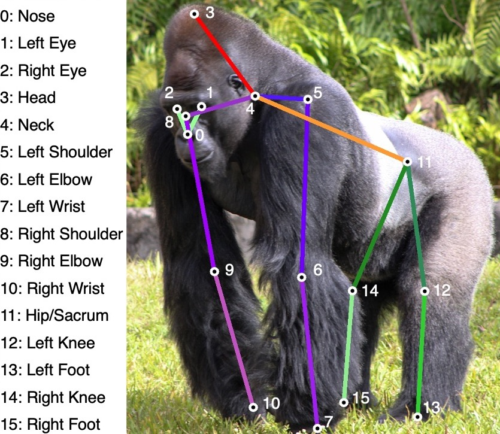

<h1 align="left">OpenApePose: a database of annotated ape photographs for pose estimation
</h1> 

<p align="center">
  <a href="#introduction">Introduction</a> |
  <a href="#Overview">Overview</a> |
  <a href="#Download">Download</a> |
  <a href="#Annotation-format">Annotation format</a> |
  <a href="#Usage-instructions">Usage instructions</a> |
  <a href="#License">License</a> |
  <a href="#Cite-as">Cite as</a> 
</p>

## Introduction

<p align="left">This repository contians the <a href='https://arxiv.org/abs/2212.00741'>OpenApePose</a> dataset. OpenApePose contains 71,868 photographs of six ape species in naturalistic contexts. Because of their close relationship with humans, non-human apes (chimpanzees, bonobos, gorillas, orangutans, and gibbons, including siamangs) are of great scientific interest. The goal of understanding their complex behavior would be greatly advanced by the ability to perform video-based behavioral tracking. Tracking, however, requires high-quality annotated datasets of ape photographs. Here we present a new public dataset of 71,868 photographs, annotated with 16 body landmarks, of six ape species in naturalistic contexts. </p>

<p align="center">

</p>

## Overview

<p align="left">The dataset includes species from the ape (<i>Hominoidea</i>) superfamily. This includes the great apes (<i>Hominidae</i> family) and the lesser apes, gibbons and siamangs (<i>Hylobatidae</i> family). Among the <i>Hominidae</i>, we include four species: bonobos (<i>Pan paniscus</i>), chimpanzees (<i>Pan troglodytes</i>), gorillas (<i>Gorilla gorilla</i>), and orangutans (<i>Pongo sp.</i>). Among the gibbons we separate the siamangs (<i>Symphalangus syndactylus</i>) but include other species under the "gibbon" label. Below is the number of images from each of these species.  </p>

### Number of images per species

<p>
<table div align=center>
  
<tbody>
  <tr>
    <td><b>Species</b></td>
    <td>Bonobos</td>
    <td>Chimpanzees</td>
    <td>Gibbons</td>
    <td>Gorillas</td>
    <td>Orangutans</td>
    <td>Siamangs</td>
  </tr>
  <tr>
    <td><b>Images</b></td>
    <td>11,685</td>
    <td>18,010</td>
    <td>9,274</td>
    <td>12,905</td>
    <td>12,722</td>
    <td>7,272</td>
</tbody>
</table>
</p>

### Keypoint definition

<p align="left">We include 16 landmarks in the following order: Nose, Left eye, Right eye, Head, Neck, Left shoulder, Left elbow, Left wrist, Right shoulder, Right elbow, Right wrist, Hip/Sacrum, Left knee, Left foot, Right knee, Right foot </p>
<p align="center">

</p>


## Download

The dataset can be downloaded from
<a href='https://drive.google.com/drive/folders/1-1jhlQ14WxRzZ5nHD6rW4d4sOjyeI9fi?usp=share_link'>[Google Drive]</a> 

The downloaded dataset would look as follows:

```text
|── OpenApePose
    │-- annotations
    │   │-- oap_all.json
    │   |-- oap_test.json
    │   |-- oap_train.json
    │   |-- oap_val.json
    │-- images
    │   │-- 00001_oap.JPG
    │   │-- 00002_oap.jpg
    │   │-- ...
    │-- models
    │   │-- hrnet_w48_oap_256x192_full.pth
    │-- code
    │   │-- TopDownOAPDataset.py
    │   │-- animal_oap_dataset.py
    │   |-- __init__.py
    │   |-- hrnet_w48_oap_256x192_full.py
```

## Annotation format

<p align="left">Our annotation format is inspired from other similar datasets such as <a href='https://idp.springer.com/authorize/casa?redirect_uri=https://link.springer.com/article/10.1007/s11263-022-01698-2&casa_token=kBSmHxBJToAAAAAA:mKpt4xKGExOp6471wnf2AB-bGka2o1A_rdih4VHg0yffT1sllepqI5c5R0nwtT1vt4bqiLKQdic5XnM'>OpenMonkeyPose</a>, <a href='https://cocodataset.org/#keypoints-2017'>COCO</a> etc. They are provided as separate JSON files for the full dataset, as well as train, validation, and test set splits used in the original <a href='https://arxiv.org/abs/2212.00741'>OpenApePose</a> paper. The annotation JSONs have the following format: </p>

```text
{
  "data": [
  
    { 
      "file":   str, 
      "species":   str, 
      "bbox":   [x, y, width, height], 
      "landmarks":   [x1,y1, ...,x16,y16],
      "visibility":   [v1,v2,...,v16]
    },
    
    { 
      "file":   str, 
      "species":   str, 
      "bbox":   [x, y, width, height], 
      "landmarks":   [x1,y1, ...,x16,y16],
      "visibility":   [v1,v2,...,v16]
    },
    
  ....
  
  ]
}
```
<p align="left">Within each JSON file, all the annotations are included in the "data" tag. Each annotation contains the following tags: "file", "species", "bbox", "landmarks", and "visibility". "file" specifies the name of the file in the images folder. "species" specifies the species of the individual ape in the bounding box that is annotated. "bbox" specifies a bounding box in the image that contains the annotated ape. The bounding box format used is [x,y,width,height] where [x,y] specifies the x and y corridnate of the top-left of the bounding box, width specifies the width of the bounding box in pixels, and height specifies the height of the bounding box in pixels. "landmarks" specifies the x and y coordinates of the 16 landmarks in the order specified above. "visibility" specifies whether a given landmark is occluded (0) or visible (1).

## Usage instructions

<p align="left"> The included HRNet-W48 PyTorch model is trained using the pipelines and tools available in <a href='https://mmpose.readthedocs.io/en/latest/'>MMPose</a>. </p>

### Installation

<p align="left"> Download and install mmpose using the <a href='https://mmpose.readthedocs.io/en/latest/install.html#installation'>installation instructions</a> to be able to use the package. </p>

<p align="left"> Refer to the documentation, in particular <a href='https://mmpose.readthedocs.io/en/latest/tutorials/0_config.html'>tutorial 0</a> and <a href='https://mmpose.readthedocs.io/en/latest/tutorials/2_new_dataset.html'>tutorial 2</a> to get a sense of how to use the tools in MMPose for training/inference using PyTorch models on a custom dataset. For using the model for inference on your photo/video, you would need to register the OpenApePose dataset class (tutorial 2).

### Using the included code with MMPose

<p align="left"> We have included the necessary code for defining and registering a custom dataset class for the OpenApePose dataset. </p>

<p align="left"> Paste the included file (TopDownOAPDataset.py) in the following location in the MMPose directory on your computer: (.../mmpose/configs/_base_/datasets/TopDownOAPDataset.py) </p>

<p align="left"> Then create a NEW folder, named 'oap', and paste the animal_oap_dataset.py file in the following location:  (.../mmpose/mmpose/datasets/datasets/oap/animal_oap_dataset.py) </p>

<p align="left"> Update the __init__.py in ../mmpose/mmpose/datasets/datasets/ by replacing it with the included __init__.py </p>

<p align="left"> Create a new __init__.py file in the following location: .../mmpose/mmpose/datasets/datasets/oap/. Then, add the following code in this __init__.py file to ensure that the dataset class is registered properly for training and inference:<br />
<br />
from .animal_oap_dataset import TopDownOAPDataset<br />
__all__ = [ 'TopDownOAPDataset'] </p>

### Inference with the included model

<p align="left"> Paste the config file in (.../mmpose/configs/animal/2d_kpt_sview_rgb_img/topdown_heatmap/macaque/hrnet_w48_oap_256x192_full.py) </p>

<p align="left"> Once the dataset class is registered and the above files pasted in respective locations, you could use the trained model (hrnet_w48_oap_256x192_full.pth) for inference on your own photos/videos. Refer to <a href='https://mmpose.readthedocs.io/en/latest/demo.html'>the documentation on running demos</a> to get a sense of how to do this. </p>

### Training new models with OpenApePose dataset

<p align="left"> You can train new models using the OAP dataset with MMPose once the dataset class is registered, and you have downloaded the images and stored it in the (.../mmpose/data/oap/images) folder, and annotations in the (.../mmpose/data/oap/annotations) folder. Refer to <a href='https://mmpose.readthedocs.io/en/latest/get_started.html#train-a-model'>the documentation</a> for training models on a custom dataset. </p>

<p align="left"> However, you are not limited to using MMPose as the OpenApePose dataset and annotations can be transformed to work with many different packages. </p>

## License

The dataset follows CC-BY-4.0 license.

## Cite as
Desai, N., Bala, P., Richardson, R., Raper, J., Zimmermann, J., & Hayden, B. (2022). OpenApePose: a database of annotated ape photographs for pose estimation. arXiv preprint arXiv:2212.00741.
